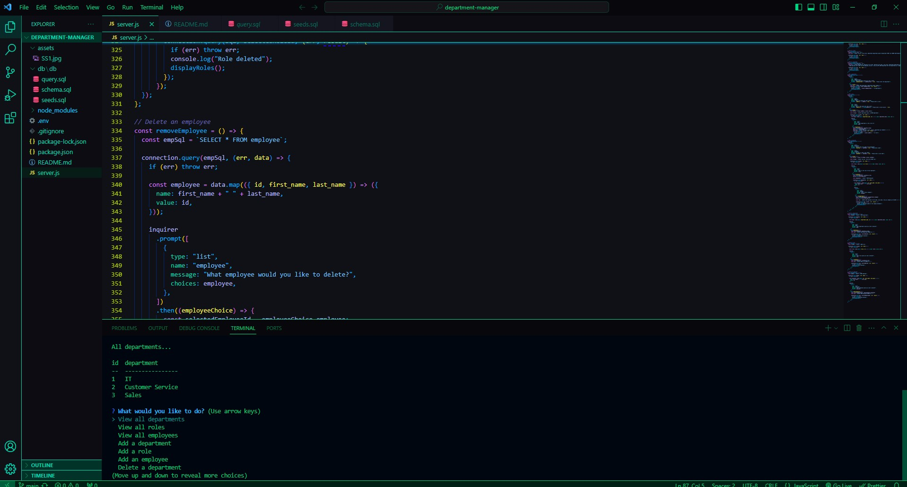

# Company Department Tracker

An online note taking application where you can save and delete notes using Express.js

[](https://opensource.org/licenses/MIT)

---

## Contents

1. [About](#about)
2. [Story](#user-story)
3. [Visuals](#visuals)
4. [Installation](#installation)
5. [License](#license)
6. [Contributing](#contributing)
7. [Contact](#contact)

---

## About

This command line application is built to aid tracking a comapny's departments, employees, roles and any information that could fall under those categories. It is able to view, edit, etc. any of the above mentioned for real time tracking of a company and its assets.

---

### User Story

```
AS A business owner
I WANT to be able to view and manage the departments, roles, and employees in my company
SO THAT I can organize and plan my business
```

## Visuals:



---

## Installation:

```
To clone the repo:

git clone in gitbash
```

---

## License

License used for this project - MIT

- For more information on license types, please reference this website
  for additional licensing information - [https://choosealicense.com/](https://choosealicense.com/).

---

## Contributing:

To contribute to this application, create a pull request.
Here are the steps needed for doing that:

- Fork the repo
- Create a feature branch (git checkout -b NAME-HERE)
- Commit your new feature (git commit -m 'Add some feature')
- Push your branch (git push)
- Create a new Pull Request

Following a code review, your feature will be merged.

---

## Contact:

- GitHub Username: [conquerersHaki](https://github.com/conquerersHaki)
- GitHub Email: keighleychristina@yahoo.com
